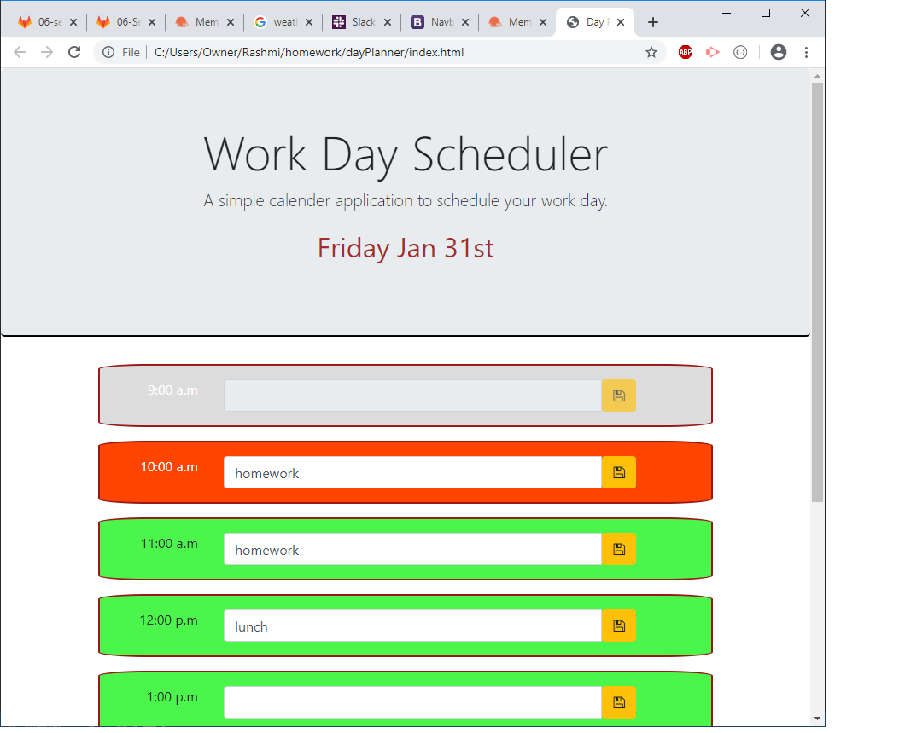

# The Repository
Day Planner is a scheduler application. It is responsive in nature for large, medium and small screens. 

## Installation:
This project uses HTML, CSS with Bootstrap powered by jquery. Localstorage is used to store data.
The code editor used here is VScode. Version controller is Github.

## Usage:
- Day planner is a simple calendar application that allows the user to save events for each hour of the day.The app displays standard business hours (9 a.m. to 5 p.m.). 
 
- A daily planner allows employees to see their day at a glance, schedule time effectively, and improve productivity. 

## Deployed link:
[a link] (https://graphicaction.github.io/dayPlanner/)

## Credits:
UNC Chapelhill

## License
Copyright (c). All rights reserved.